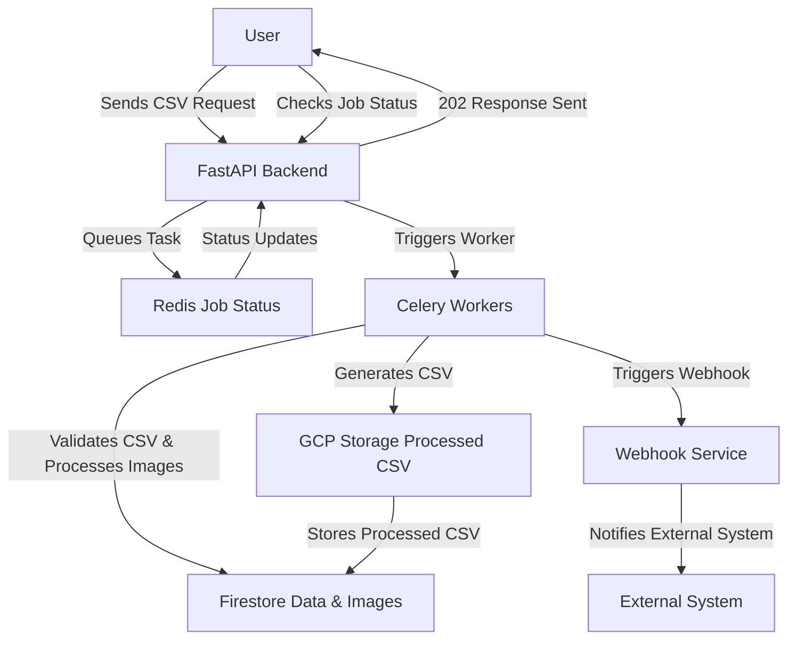

# Low-Level Design (LLD) - Image Processing System

## 1. Introduction
The Image Processing System is designed to process images asynchronously from a CSV file. 
It uses FastAPI for the backend, Celery for task queuing, Redis as the message broker, 
and Firestore as the database and storage system.

---

## 2. System Architecture Diagram
Here's a visual representation of the system visually

---

## 3. Component Breakdown
This section describes each component’s role and function.

### 1. FastAPI Backend (`app/`)
✅ Responsibilities:
- Handles CSV file uploads (`app/api/upload.py`).
- Manages request statuses (`app/redis.py`).
- Initiates Celery tasks for processing.

📂 Files Handling FastAPI:
- `main.py` - Entry point for FastAPI.
- `api/upload.py` - Handles CSV uploads.
- `api/webhook.py` - Receives webhook notifications.

---

### 2. Redis (Message Queue)
✅ Responsibilities:
- Stores request statuses (`app/redis.py`).
- Queues Celery tasks for background processing.

📂 File Handling Redis:
- `redis.py` - Updates and retrieves task statuses.

---

### 3. Celery Workers (`app/workers/`)
✅ Responsibilities:
- Asynchronously processes CSV and images.
- Compresses images and uploads them to Firestore.
- Calls the webhook upon completion.

📂 Worker Tasks:
1. `process_csv(file_content, request_id)`: Reads and validates CSV.
2. `process_images(validated_rows, request_id)`: Compresses images and stores them in Firestore.
3. `trigger_webhook(request_id, csv_url)`: Notifies external services when processing is complete.

📂 File Handling Celery Workers:
- `workers/celery_worker.py` - Defines Celery app.
- `services/csv_handler.py` - Processes CSV data.

---

### 4. Firestore (Database & Storage)
✅ Responsibilities:
- Stores processed image details in the `processed-images` collection.

📂 Firestore Files:
- `firebase_config.py` - Handles Firestore connection.

---

### 5. Webhook (External Notification)
✅ Responsibilities:
- Sends a `POST` request to notify external systems upon processing completion.

📂 File Handling Webhook:
- `api/webhook.py` - Handles webhook callbacks.

---

## 4. Data Flow
1. **User uploads CSV** → `FastAPI` validates it → Stores request in `Firestore`.
2. **Redis queues request** → Celery `process_csv` task starts.
3. **Celery processes images** → Stores processed images in `Firestore`.
4. **CSV is generated** → Stored in Firestore.
5. **Webhook is triggered** → External system gets notified.

---

## 6. Database Schema (Firestore)
### Collection: `processed-images`
| Field          | Type   | Description                                   |
|----------------|--------|-----------------------------------------------|
| `request_id`   | String | Foreign key referencing `processing_requests` |
| `product_name` | String | Name of the product                           |
| `input_url`    | String | URL of the input image                        |
| `output_url`   | String | URL of the compressed image                   |

---

## 7. Celery Worker Tasks
| Task Name                                    | Description                                             |
|----------------------------------------------|---------------------------------------------------------|
| `process_csv(file_content, request_id)`      | Reads CSV, validates data, and queues image processing. |
| `process_images(validated_rows, request_id)` | Compresses images and uploads them to Firestore.        |

---